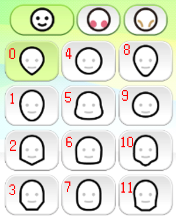
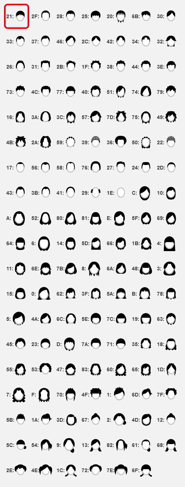
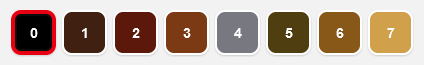

# Mii Data

This is for Mii data that's used in Nintendo Network, I haven't researched any other sources yet.

## Data Structure

> NOTE: All values are in little-endian.  

| Offset | Value             | Length | Type         | Description                                                                                                                                                                                                                                                                                                                           |
| ------ | ----------------- | ------ | ------------ | ------------------------------------------------------------------------------------------------------------------------------------------------------------------------------------------------------------------------------------------------------------------------------------------------------------------------------------- |
| 0x0    | Unknown           | 0x1    | Byte         | Unknown                                                                                                                                                                                                                                                                                                                               |
| 0x1    | Unknown           | 0x1    | Byte         | Unknown                                                                                                                                                                                                                                                                                                                               |
| 0x2    | Unknown           | 0x1    | Byte         | Unknown                                                                                                                                                                                                                                                                                                                               |
| 0x3    | Mii Version       | 0x1    | Byte         | Mii's version, Nintendo Network returns `40`.                                                                                                                                                                                                                                                                                         |
| 0x4    | Author ID         | 0x8    | Byte Array   | Undocumented                                                                                                                                                                                                                                                                                                                          |
| 0xC    | Mii ID            | 0xA    | Byte Array   | Undocumented                                                                                                                                                                                                                                                                                                                          |
| 0x16   | Unknown           | 0x2    | Short        | Unknown, seems to always be null                                                                                                                                                                                                                                                                                                      |
| 0x18   | Mii Metadata Bits | 0x2    | (Bits) Short | `Bit 15` - Unknown (seems to always be 0) `Bit 14` - Unknown (seems to always be 1) `Bits 13-10` - 4 bits make up the Mii's favourite colour index (0-11) `Bits 9-5` - 5 bits make up the Mii's birth day (0-31) `Bits 4-1` - 4 bits make up the Mii's birth month (0-12) `Bit 0` - Gender (0 = Male, 1 = Female) |
| 0x1A   | Name              | 0x14   | String       | Mii's name, encoded in UTF-16LE.                                                                                                                                                                                                                                                                                                      |
| 0x2E   | Height            | 0x1    | Byte         | Mii's height (default is `0x40`, range is `0x00`-`0x7F`).                                                                                                                                                                                                                                                                             |
| 0x2F   | Weight            | 0x1    | Byte         | Mii's weight (default is `0x40`, range is `0x00`-`0x7F`).                                                                                                                                                                                                                                                                             |
| 0x30   | Head Details      | 0x1    | (Bits) Byte  | Provides information about the Mii's skin and head. `Bits 7-5` - 3 bits make up the Mii's skin tone index `Bits 4-1` - 4 bits make up the Mii's head shape. See all shapes [here](#Head-Shapes). `Bit 0` - Is Mingling                                                                                                    |
| 0x31   | Face Details      | 0x1    | Nybbles      | Provides information about the Mii's face. `First Nybble` - Blush Type Index `Second Nybble` - Wrinkles Index                                                                                                                                                                                                                 |
| 0x32   | Hair Style        | 0x1    | Byte         | The Mii's hair style. See all styles [here](#Hair-Styles).                                                                                                                                                                                                                                                                            |
| 0x33   | Hair Data         | 0x1    | (Bits) Byte  | Provides information about the Mii's hair. `Bits 7-4` - Unused `Bit 3` - Is Hair Flipped `Bits 2-0` - Hair colour index. See all colours [here](#Hair-Colours).                                                                                                                                                           |

# Head Shapes

# Hair Styles

# Hair Colours

