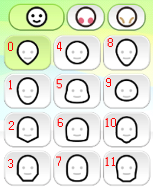
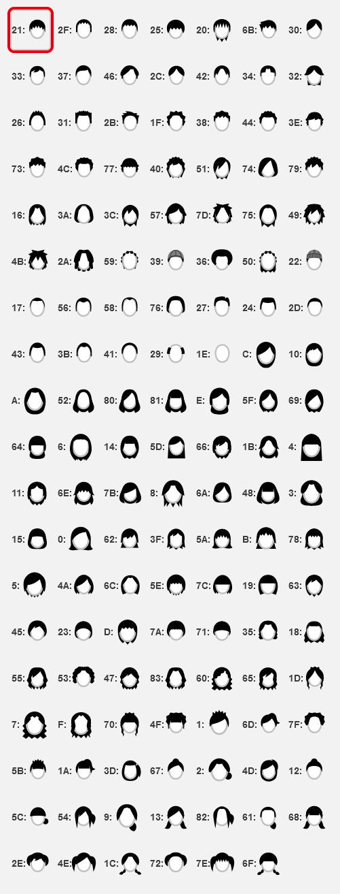
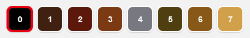
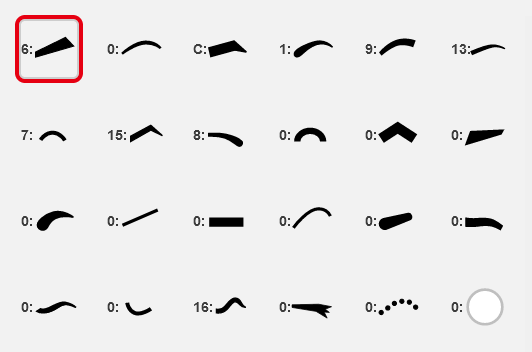

# Mii Data (Generation 2)

This is for Mii data that's used in 3DS, Wii U, and Nintendo Network.

## Data Structure

> NOTE: All values are in little-endian.  

| Offset | Value             | Length | Type         | Description                                                                                                                                                                                                                                                                                                                                                                                                                                                                                                                                                                                                                                                                                                                       |
| ------ | ----------------- | ------ | ------------ | --------------------------------------------------------------------------------------------------------------------------------------------------------------------------------------------------------------------------------------------------------------------------------------------------------------------------------------------------------------------------------------------------------------------------------------------------------------------------------------------------------------------------------------------------------------------------------------------------------------------------------------------------------------------------------------------------------------------------------- |
| 0x0    | Unknown           | 0x1    | Byte         | Unknown                                                                                                                                                                                                                                                                                                                                                                                                                                                                                                                                                                                                                                                                                                                           |
| 0x1    | Unknown           | 0x1    | Byte         | Unknown                                                                                                                                                                                                                                                                                                                                                                                                                                                                                                                                                                                                                                                                                                                           |
| 0x2    | Unknown           | 0x1    | Byte         | Unknown                                                                                                                                                                                                                                                                                                                                                                                                                                                                                                                                                                                                                                                                                                                           |
| 0x3    | Mii Version       | 0x1    | Byte         | Mii's version, Nintendo Network returns `40`.                                                                                                                                                                                                                                                                                                                                                                                                                                                                                                                                                                                                                                                                                     |
| 0x4    | Mii ID            | 0x4    | Byte Array   | Undocumented                                                                                                                                                                                                                                                                                                                                                                                                                                                                                                                                                                                                                                                                                                                      |
| 0x8    | System ID         | 0x8    | Byte Array   | System ID of the owner of this Mii. This is likely the part that allows seedminer to be possible.                                                                                                                                                                                                                                                                                                                                                                                                                                                                                                                                                                                                                                 |
| 0x14   | Unknown           | 0x2    | Short        | Unknown                                                                                                                                                                                                                                                                                                                                                                                                                                                                                                                                                                                                                                                                                                                           |
| 0x16   | Unknown           | 0x2    | Short        | Unknown, seems to always be null. Probably padding.                                                                                                                                                                                                                                                                                                                                                                                                                                                                                                                                                                                                                                                                               |
| 0x18   | Mii Metadata Bits | 0x2    | (Bits) Short | `Bit 15` - Unknown (seems to always be 0) `Bit 14` - Unknown (seems to always be 1) `Bits 13-10` - 4 bits make up the Mii's favourite colour index (0-11) `Bits 9-5` - 5 bits make up the Mii's birth day (0-31) `Bits 4-1` - 4 bits make up the Mii's birth month (0-12) `Bit 0` - Gender (0 = Male, 1 = Female)                                                                                                                                                                                                                                                                                                                                                                                             |
| 0x1A   | Name              | 0x14   | String       | Mii's name, encoded in UTF-16LE.                                                                                                                                                                                                                                                                                                                                                                                                                                                                                                                                                                                                                                                                                                  |
| 0x2E   | Height            | 0x1    | Byte         | Mii's height (default is `0x40`, range is `0x00`-`0x7F`).                                                                                                                                                                                                                                                                                                                                                                                                                                                                                                                                                                                                                                                                         |
| 0x2F   | Weight            | 0x1    | Byte         | Mii's weight (default is `0x40`, range is `0x00`-`0x7F`).                                                                                                                                                                                                                                                                                                                                                                                                                                                                                                                                                                                                                                                                         |
| 0x30   | Head Details      | 0x1    | (Bits) Byte  | Provides information about the Mii's skin and head. `Bits 7-5` - 3 bits make up the Mii's skin tone index `Bits 4-1` - 4 bits make up the Mii's head shape. See all shapes [here](#Head-Shapes). `Bit 0` - Is Mingling                                                                                                                                                                                                                                                                                                                                                                                                                                                                                                |
| 0x31   | Face Details      | 0x1    | Nybbles      | Provides information about the Mii's face. `First Nybble` - Blush Type Index `Second Nybble` - Wrinkles Index                                                                                                                                                                                                                                                                                                                                                                                                                                                                                                                                                                                                             |
| 0x32   | Hair Style        | 0x1    | Byte         | The Mii's hair style. See all styles [here](#Hair-Styles).                                                                                                                                                                                                                                                                                                                                                                                                                                                                                                                                                                                                                                                                        |
| 0x33   | Hair Data         | 0x1    | (Bits) Byte  | Provides information about the Mii's hair. `Bits 7-4` - Unused `Bit 3` - Is Hair Flipped `Bits 2-0` - Hair colour index. See all colours [here](#Hair-Colours).                                                                                                                                                                                                                                                                                                                                                                                                                                                                                                                                                       |
| 0x34   | Eye Data          | 0x4    | (Bits) Int   | The Mii's eye style. `Bits 31-30` - Unused `Bits 29-25` - Eye Height (higher values means lower positioning) [max: 18] `Bits 24-20` - Eye Spacing (higher values means larger spacing) [max: 12] `Bits 19-16` - Eye Rotation (higher values means more counter-clockwise) [max: 7] `Bits 15-13` - Eye Stretch (higher values means more stretched) [max: 6] `Bit 12` - Unused `Bits 11-9` - Eye Size (higher values means bigger size) [max: 7] `Bits 8-6` - Eye Colour Index. See all colours [here](#Eye-Colours). `Bits 5-0` - Eye type index. List is not finished yet.                                                                                                                   |
| 0x38   | Eyebrow Data      | 0x4    | (Bits) Int   | The Mii's eyebrow style. `Bits 31-30` - Unused `Bits 29-25` - Eyebrow Height (higher values means lower positioning) [min: 3, max: 18] `Bits 24-21` - Eyebrow Spacing (higher values means larger spacing) [max: 12] `Bit 20` - Unused `Bits 19-16` - Eyebrow Rotation (higher values means more counter-clockwise) [max: 11] `Bit 15` - Unused `Bits 14-12` - Eyebrow Stretch (higher values means more stretched) [max: 6] `Bits 11-8` - Eyebrow Size (higher values means bigger size) [max: 8] `Bits 7-5` - Eyebrow Colour Index. See all colours [here](#Hair-Colours). `Bits 4-0` - Eyebrow type index. List is not complete yet, but here's what I have [so far](#Eyebrow-Styles). |

# Head Shapes

# Hair Styles

# Hair Colours

# Eye Colours

# (WIP.) Eyebrow Styles

